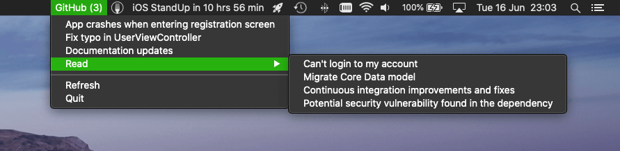
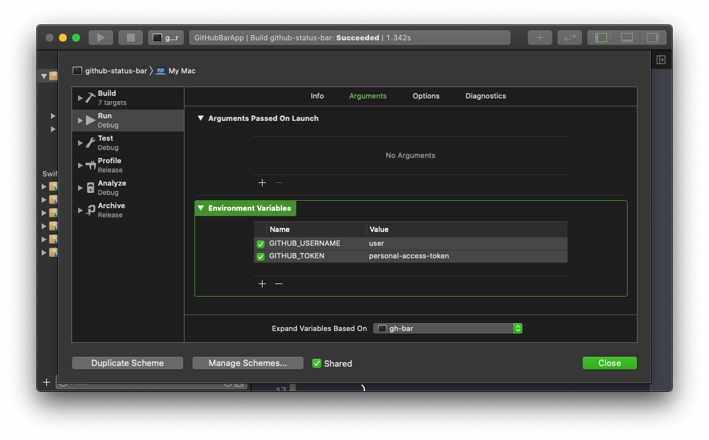

# GitHub Status Bar macOS App


GitHub notifications in macOS status bar. Written in Swift.



This project demonstrates **unidirectional data flow architecture** implementation in a simple Swift application.

## 🚀 Build and run

### Requirements

- Xcode 11 with Swift 5.2

### Run

You can run the app directly from terminal, by executing:

```sh
GITHUB_USERNAME=user GITHUB_TOKEN=personal-access-token swift run
```

Replace environment variables with your actual credentials.

- `GITHUB_USERNAME` - GitHub username
- `GITHUB_TOKEN` - GitHub [Personal Access Token](https://github.com/settings/tokens)

## 🛠 Develop

### Setup

Open `Package.swift` in Xcode.You can run the app using `github-status-bar` shared build scheme. 

The GitHub credentials can be set in the scheme configuration:



### Test

You can run tests from Xcode or by executing the following command in terminal:

```sh
swift test
```

### Package structure

Target|Description
:--|:--
`Executable`|The macOS app executable
`App[Tests]`|Core application logic
`StatusBar[Tests]`|Status bar menu component
`GitHub[Tests]`|GitHub REST API v3 client

### External dependencies

Dependency|Description
:--|:--
[ComposableArchitecture](https://github.com/pointfreeco/swift-composable-architecture)|Architecture foundations
[SwiftEndpoint](https://github.com/darrarski/SwiftEndpoint)|Networking layer abstration
[Quick](https://github.com/Quick/Quick)|Behavior-driven development framework used in test targets
[Nimble](https://github.com/Quick/Nimble)|Assertion matcher framework used in test targets
[Difference](https://github.com/krzysztofzablocki/Difference)|Assertion helper framework used in test targets

## ☕️ Do you like the project?

<a href="https://www.buymeacoffee.com/darrarski" target="_blank"></a>

## 📄 License

Copyright © 2020 [Dariusz Rybicki Darrarski](http://www.darrarski.pl)

License: [GNU GPLv3](LICENSE)
